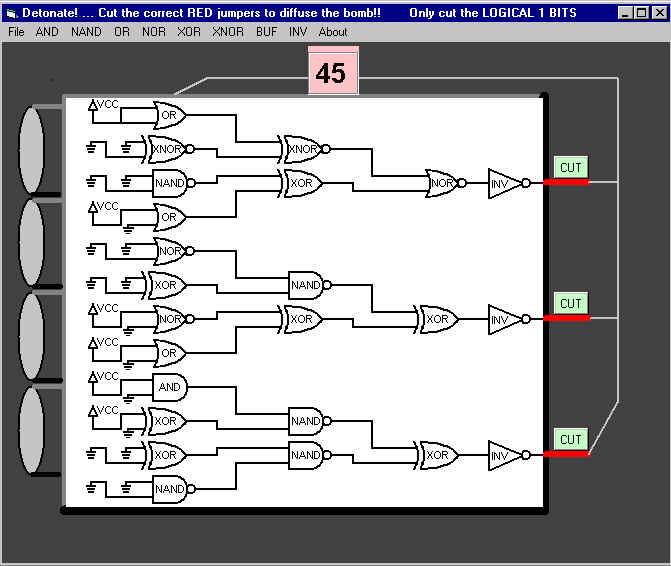



## Detonate

### Description

You have 60 seconds to defuse the bomb before it detonates. The problem is, the only information available is a logic diagram. You need to decode the logic to figure out which jumpers to cut. The initial inputs on the left of each logic gate are either a GROUND (0) or VCC-voltage (1). Follow the logic through and only cut the jumpers that are a logic=1.  Good Luck!!
 
### More Info
 

             |
---                |---
**Submitted On**   |2001-07-17 14:22:40
**By**             |[Max Seim](https://github.com/Planet-Source-Code/PSCIndex/blob/master/ByAuthor/max-seim.md)
**Level**          |Beginner
**User Rating**    |4.7 (47 globes from 10 users)
**Compatibility**  |VB 5\.0, VB 6\.0
**Category**       |[Complete Applications](https://github.com/Planet-Source-Code/PSCIndex/blob/master/ByCategory/complete-applications__1-27.md)
**World**          |[Visual Basic](https://github.com/Planet-Source-Code/PSCIndex/blob/master/ByWorld/visual-basic.md)
**Archive File**   |[Detonate229627172001\.zip](https://github.com/Planet-Source-Code/max-seim-detonate__1-25137/archive/master.zip)

